# Entrega 2 — Público-alvo e análise de concorrência

**Data:** 02/09/2026  
**Status:** 🟨 em andamento  
**Responsabilidade mínima:** cada integrante analisa pelo menos 1 concorrente/interface representativa; a equipe produz síntese comparativa.

## Objetivo da atividade

Compreender soluções do mesmo domínio **e também interfaces familiares ao público-alvo**. O objetivo não é copiar telas, mas identificar convenções, padrões, affordances percebidas, problemas recorrentes, expectativas e oportunidades de design.

> **Concorrente não precisa ser idêntico ao produto.** Pode atuar na mesma área, resolver objetivo semelhante ou disputar a mesma necessidade. Quando não houver concorrente direto, use produtos análogos e softwares que o público já utiliza.

### Para TCCs que não previam interface

Não procure apenas um “concorrente do algoritmo”. Investigue **interfaces profissionais que materializam atividades semelhantes** às que o usuário escolhido precisaria realizar.

Exemplos:

- TCC de banco de dados → consoles de administração, ferramentas para DBA, monitoramento e análise de consultas;
- TCC de LLM/ML → painéis de experimentos, gestão de modelos/datasets, comparação de métricas, revisão de resultados;
- TCC de análise de dados → dashboards, ferramentas de BI, filtros, relatórios e exploração;
- TCC de infraestrutura/API → portais administrativos, observabilidade, logs, gestão de credenciais e uso;
- TCC de cibersegurança → consoles de alertas, triagem, histórico e auditoria.

A pergunta é: **“que convenções esse perfil já conhece para executar tarefas equivalentes?”**

## Entrada obrigatória da Entrega 1

Retome o mapa inicial de alternativas e produtos citado na Entrega 1. Aqui a equipe deixa de trabalhar apenas com impressão inicial e passa a **investigar sistematicamente** cada solução.

| Item citado na Entrega 1 | Tipo | Por que foi citado | Status inicial | Decisão nesta entrega |
|---|---|---|---|---|
| SUMO | ferramenta cotidiana / processo atual | É o ambiente de simulação utilizado no TCC para representar redes, veículos, detectores e semáforos e executar os experimentos. | F | analisar como ferramenta familiar ao domínio, principalmente por meio do NetEdit e do SUMO-GUI |
| Scripts/controladores externos integrados ao simulador | processo atual | Representam a forma técnica utilizada no TCC para implementar e executar as estratégias de controle semafórico. | F | não analisar como concorrente de interface; manter como referência do processo atual |
| CityFlow | concorrente / alternativa técnica | Foi identificado no TCC como ferramenta relacionada à simulação de tráfego e à pesquisa de estratégias de controle. | F | não aprofundar como C01/C02 nesta entrega, pois apresenta menor interesse para a análise das tarefas de interação priorizadas |
| Outras ferramentas profissionais de simulação e análise de tráfego | concorrente / interface representativa | A Entrega 1 identificou como lacuna a necessidade de investigar ferramentas profissionais utilizadas para configurar, executar e analisar simulações. | ? | analisar por meio do Aimsun Next e do PTV Vissim |

A partir desse levantamento, foram priorizadas ferramentas com interfaces que apresentam relação com as tarefas T01–T08 definidas na Entrega 1, principalmente configuração de cenários, parametrização de experimentos, execução de simulações e interpretação e comparação de resultados.

Se uma hipótese da Entrega 1 for confirmada ou refutada durante esta análise, atualize `H01`, `H02`... em [`../RASTREABILIDADE.md`](../RASTREABILIDADE.md).

## 1. Público-alvo desta análise

Na Entrega 1, foi registrado como hipótese prioritária:

**H01 — Pesquisadores ou analistas de mobilidade urbana representam adequadamente o usuário prioritário da interface.**

Esse perfil foi escolhido por possuir relação plausível com as atividades centrais previstas para o sistema: configuração das condições de um experimento, execução de simulações e interpretação e comparação das métricas obtidas.

As principais ações identificadas na Entrega 1 foram:

- **T01:** definir ou selecionar a malha viária;
- **T02:** configurar parâmetros do experimento;
- **T03:** selecionar a estratégia de controle;
- **T04:** iniciar uma simulação;
- **T05:** verificar o estado da execução;
- **T06:** consultar as métricas obtidas;
- **T07:** comparar resultados;
- **T08:** consultar ou gerar uma síntese dos resultados.

A análise de concorrência desta entrega foi direcionada principalmente a ferramentas profissionais que materializam atividades semelhantes.

A existência dessas ferramentas e de recursos voltados à configuração, execução e análise de simulações fornece evidência de mercado de que essas atividades fazem parte do domínio. Entretanto, isso não é suficiente para confirmar todas as características atribuídas ao usuário prioritário. A hipótese H01 permanece aberta e deverá continuar sendo investigada nas próximas entregas.

## 2. Concorrentes diretos/indiretos

### Análise C01 — Aimsun Next

**Autor(a):** Gabriel Koiama de Rocha Lira — {{MATRÍCULA}}  
**Tipo:** indireto  
**Link oficial:** https://www.aimsun.com/aimsun-next/  
**Data de acesso:** 02/09/2026

#### Contexto e proposta

O Aimsun Next é uma plataforma profissional utilizada para modelagem e simulação de sistemas de transporte. A ferramenta permite representar redes viárias, definir condições de demanda, configurar cenários e experimentos, executar simulações e posteriormente analisar seus resultados.

Sua interface é relevante para o projeto porque materializa várias das atividades identificadas na Entrega 1. Embora o Aimsun Next possua um escopo muito maior que o sistema desenvolvido no TCC, existem semelhanças nas atividades de preparação de um cenário, definição das condições do experimento, execução da simulação e análise dos resultados.

Um aspecto relevante para esta análise é a organização das simulações em elementos como **Scenario, Experiment e Replication/Result**. Essa estrutura permite diferenciar as condições gerais do cenário, as configurações específicas que serão testadas e as execuções produzidas.

Essa organização possui relação com o caráter experimental do TCC, no qual as estratégias de tempo fixo, Max Pressure e Max Pressure + actuated devem ser executadas e comparadas em condições definidas.

#### Funcionalidades relevantes

| Funcionalidade | Como é realizada | Evidência/print | Observação de IHC |
|---|---|---|---|
| Visualização e organização do projeto | A interface combina visualização gráfica da rede com elementos de navegação e organização dos objetos pertencentes ao projeto. | 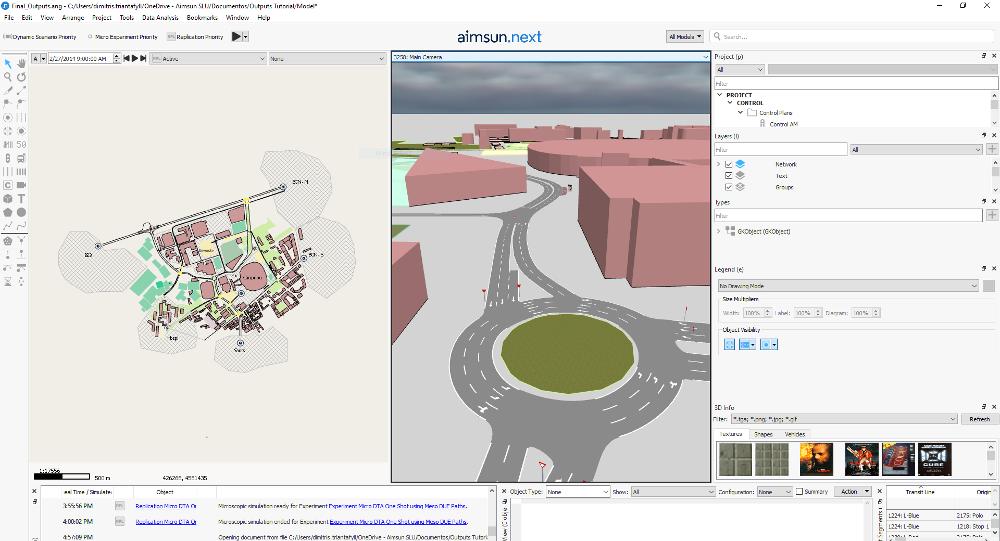 | A visualização espacial permanece relacionada às configurações do projeto, permitindo que o usuário associe elementos técnicos ao cenário representado. |
| Organização de cenários e experimentos | O software diferencia cenários, experimentos e replicações, permitindo que diferentes alternativas sejam associadas ao mesmo contexto de simulação. | 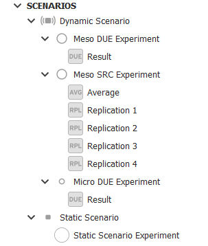 | A separação explícita entre cenário, configuração experimental e execução facilita compreender quais condições originaram cada resultado. |
| Configuração de parâmetros | Configurações são organizadas em editores e grupos de propriedades relacionados ao cenário ou ao experimento selecionado. | 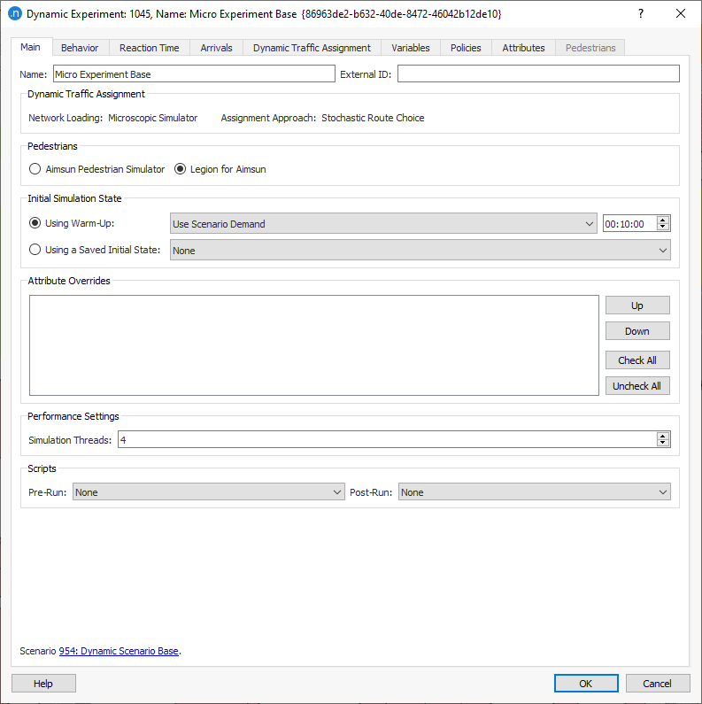 | O agrupamento de parâmetros evita apresentar todas as configurações simultaneamente, embora seja necessário compreender a hierarquia utilizada pela ferramenta. |
| Execução da simulação | A interface apresenta controles para iniciar, pausar, avançar e interromper a simulação. |  | Ações relacionadas à execução permanecem identificáveis e próximas ao contexto da simulação que está sendo realizada. |
| Feedback sobre a execução | Durante a simulação, o usuário possui informações relacionadas à execução ativa e ao estado do processamento. |  | O feedback reduz a incerteza sobre o estado atual do experimento e possui relação direta com T05. |
| Verificação da configuração | A ferramenta possui mecanismos para identificar problemas ou inconsistências antes ou durante a realização dos experimentos. | 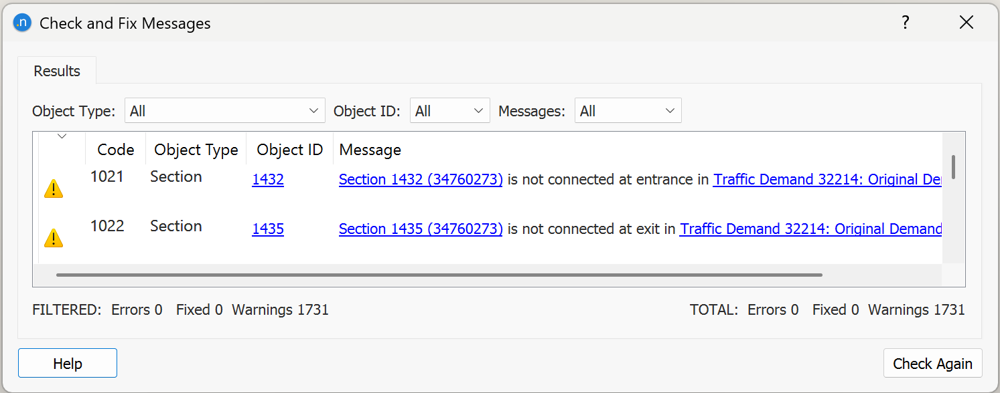 | A prevenção de erros antes da execução pode evitar que uma simulação seja realizada com condições incompletas ou inconsistentes. |
| Visualização dos resultados | Os resultados das execuções podem ser associados às respectivas replicações e analisados por diferentes formas de saída e séries de dados. | 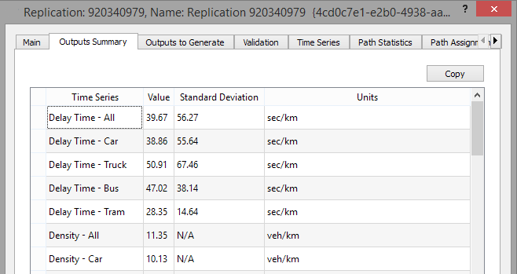 | Manter o resultado associado à execução que o originou favorece rastreabilidade e comparação. |

#### Experiência do usuário e opiniões

Nesta análise não foi utilizada uma opinião isolada de usuário como evidência geral sobre a qualidade da interface.

Foi realizada uma **inspeção documental pela equipe**, utilizando a documentação oficial e as telas disponibilizadas pelo próprio Aimsun.

A organização em cenário, experimento e replicação apresenta uma estrutura coerente com atividades experimentais, pois permite relacionar diferentes configurações e execuções sem tratá-las como projetos completamente independentes.

Por outro lado, a interface apresenta grande quantidade de funcionalidades, editores, parâmetros e níveis de organização. Para o nosso projeto, isso evidencia um risco importante: reproduzir a complexidade de uma ferramenta profissional completa mesmo quando o escopo do TCC possui um conjunto mais restrito de tarefas.

A principal lição não é eliminar parâmetros técnicos, mas investigar quais informações realmente precisam ser apresentadas em cada etapa e quais podem permanecer ocultas ou agrupadas até que sejam necessárias.

#### Preço/modelo de negócio

O Aimsun Next é um software proprietário e comercial.

A empresa disponibiliza diferentes formas de licenciamento e versões do produto. Os valores dependem da licença e da configuração contratada e não são o foco desta análise.

Para o projeto, esse aspecto é relevante principalmente por diferenciar o Aimsun Next de ferramentas abertas utilizadas no ambiente do TCC, como o SUMO.

#### Padrões e tendências percebidos

Foram identificados os seguintes padrões relevantes:

- organização hierárquica de cenário, experimento e execução;
- visualização gráfica da rede;
- painéis e grupos de propriedades;
- separação de parâmetros por contexto;
- controles visíveis de execução;
- feedback sobre o estado da simulação;
- validação das condições do experimento;
- resultados associados às execuções que os produziram;
- organização de múltiplas replicações;
- visualizações e séries de dados para análise dos resultados.

Esses padrões apresentam relação principalmente com T01, T02, T04, T05, T06 e T07.

#### Pontos positivos, limitações e lições

| Ponto | Evidência | Implicação para nosso projeto |
|---|---|---|
| Organização entre cenário, experimento e execução | Estrutura apresentada pela interface e documentação do Aimsun Next | Investigar uma forma clara de relacionar cenário, estratégia de controle e execução dentro do nosso sistema. |
| Controles identificáveis durante a simulação | Interface de execução | Manter visíveis as ações necessárias para iniciar e acompanhar o experimento. |
| Resultados vinculados à execução correspondente | Organização de replicações e resultados | Cada resultado do nosso sistema deve deixar claro qual cenário, estratégia e configuração o originaram. |
| Mecanismos de verificação | Recursos de validação da configuração | Prevenir execuções com configurações incompletas ou inválidas antes de iniciar a simulação. |
| Grande quantidade de opções | Inspeção documental da interface | Evitar apresentar ao usuário parâmetros que não possuem utilidade para a tarefa atual. |
| Organização de múltiplas execuções | Sistema de replicações | Investigar futuramente como execuções equivalentes devem ser agrupadas quando houver necessidade de comparação ou reprodução. |

> Repita a subseção para C02, C03... até atender à quantidade da equipe.

### Análise C02 — PTV Vissim

**Autor(a):** João Pedro Lopes Santana Villas Bôas — {{MATRÍCULA}}  
**Tipo:** indireto  
**Link oficial:** https://www.ptvgroup.com/en/products/ptv-vissim  
**Data de acesso:** 02/09/2026

#### Contexto e proposta

O PTV Vissim é uma ferramenta profissional de microssimulação utilizada para modelagem e avaliação de sistemas de transporte.

Sua interface permite construir e visualizar redes de tráfego, configurar elementos da simulação, executar cenários e avaliar os resultados produzidos.

Assim como o Aimsun Next, o PTV Vissim possui um escopo significativamente maior que o sistema previsto no TCC. Entretanto, sua interface materializa várias das tarefas identificadas na Entrega 1 e, por isso, constitui uma referência relevante para investigar padrões já utilizados em ferramentas profissionais do domínio.

A interface combina elementos como editor visual da rede, painéis de propriedades, listas de objetos, ferramentas de configuração, controles de simulação e mecanismos para avaliação dos resultados.

#### Funcionalidades relevantes

| Funcionalidade | Como é realizada | Evidência/print | Observação de IHC |
|---|---|---|---|
| Editor visual da rede | A rede e seus elementos podem ser visualizados e manipulados graficamente dentro do ambiente principal. | 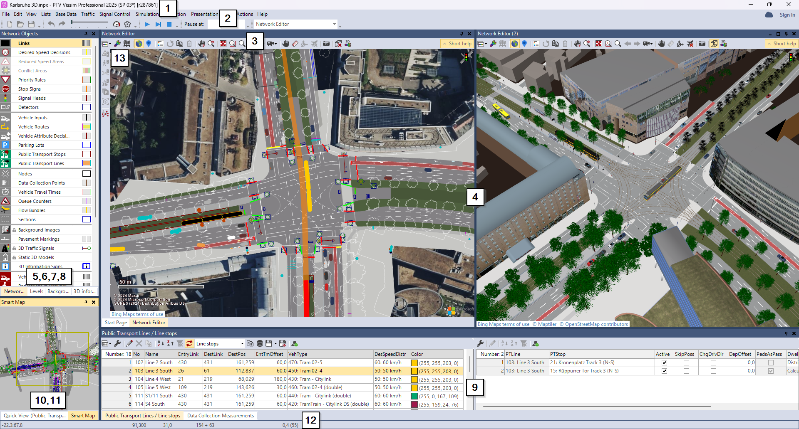 | A representação espacial permite relacionar elementos da configuração ao local em que atuam dentro da simulação. |
| Organização dos elementos do projeto | Objetos e configurações podem ser acessados por painéis, listas e estruturas de navegação. | 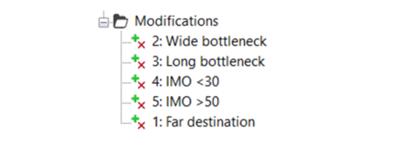 | Diferentes representações facilitam acesso a objetos, mas o grande volume de informações pode aumentar a complexidade da interface. |
| Configuração da simulação | A ferramenta permite definir parâmetros e condições antes de iniciar as execuções. | 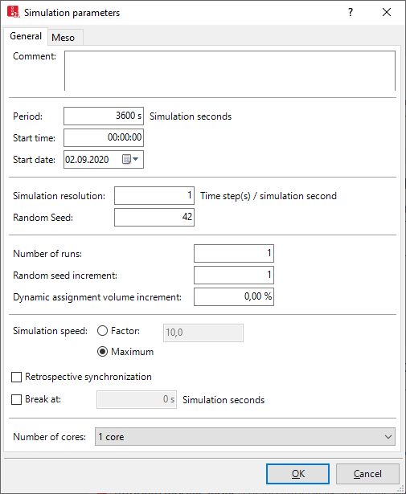 | Torna explícitas as condições utilizadas no experimento, algo importante para T02. |
| Execução da simulação | A simulação pode ser iniciada e acompanhada visualmente por controles presentes na própria interface. | 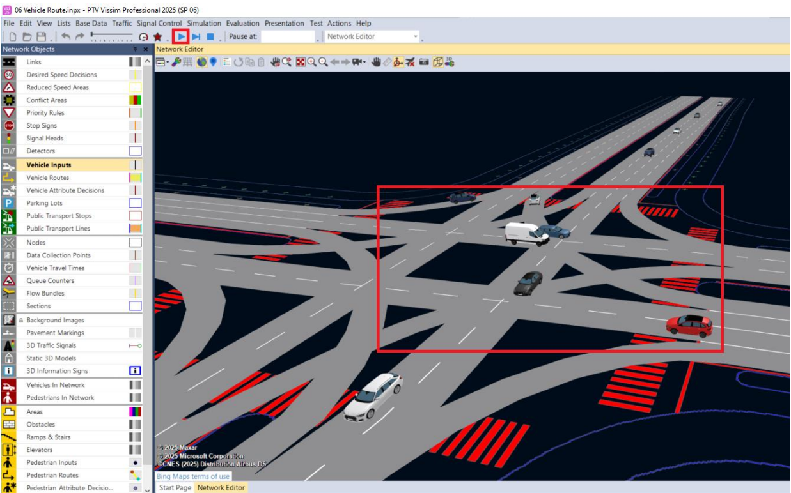 | O usuário consegue observar o comportamento do cenário enquanto o processamento ocorre, aproximando-se do acompanhamento visual previsto no projeto. |
| Feedback e estado | Informações sobre a execução ficam disponíveis durante a simulação. |  | Permite compreender se a simulação está ativa e acompanhar sua evolução. |
| Validação e prevenção de erros | A ferramenta utiliza verificações e indicações para configurações que possuem problemas ou valores inválidos. | 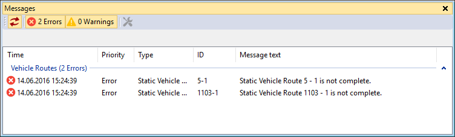 | Feedback próximo à configuração problemática pode reduzir erros antes da execução. |
| Resultados e avaliações | Informações produzidas pelas simulações podem ser apresentadas por listas, valores e diferentes formas de avaliação. | 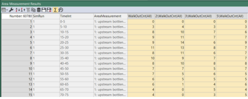 | Permite analisar resultados sem depender exclusivamente de arquivos técnicos externos. |
| Visualizações gráficas | Resultados podem ser representados graficamente para facilitar a interpretação de determinados atributos ou execuções. | 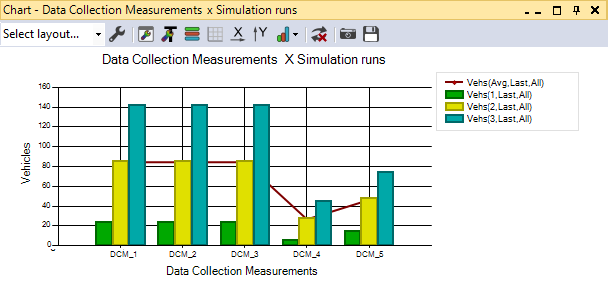 | Gráficos podem apoiar T06 e T07 quando utilizados de acordo com a métrica e o objetivo da comparação. |

#### Experiência do usuário e opiniões

Assim como em C01, a análise não considera uma opinião isolada como representação universal da experiência de uso.

Foi realizada uma **inspeção documental pela equipe** com base na interface e nos materiais oficiais do PTV Vissim.

A ferramenta apresenta forte integração entre visualização da rede, configuração e execução da simulação. Esse aspecto permite que diferentes etapas da atividade permaneçam no mesmo ambiente.

Por outro lado, a quantidade de objetos, painéis, parâmetros e possibilidades existentes evidencia novamente um possível conflito entre flexibilidade e complexidade.

Uma ferramenta profissional precisa atender diferentes tipos de estudo e, consequentemente, disponibiliza grande quantidade de recursos. O sistema previsto no TCC possui um recorte menor e não precisa reproduzir toda essa abrangência.

Para nosso projeto, a análise reforça a importância de priorizar as tarefas definidas na Entrega 1 e evitar adicionar funcionalidades apenas porque estão presentes em ferramentas profissionais.

#### Preço/modelo de negócio

O PTV Vissim é um software proprietário e comercial.

O fabricante disponibiliza diferentes opções de licenciamento de acordo com o uso e os recursos necessários.

Para esta análise, o modelo de negócio é relevante principalmente para caracterizar a solução como uma ferramenta profissional especializada. O projeto do TCC, por outro lado, utiliza o SUMO como ambiente de simulação, que possui uma proposta aberta e diferente do modelo comercial do Vissim.

#### Padrões e tendências percebidos

Os seguintes padrões foram considerados relevantes:

- editor visual da rede;
- painéis e listas de objetos;
- propriedades associadas ao elemento selecionado;
- configuração dos parâmetros da simulação;
- controles de execução;
- feedback sobre o estado da simulação;
- mecanismos de validação;
- listas e visualizações de resultados;
- gráficos para análise;
- organização de diferentes cenários e execuções.

Esses padrões possuem relação principalmente com T01, T02, T04, T05, T06 e T07.

#### Pontos positivos, limitações e lições

| Ponto | Evidência | Implicação para nosso projeto |
|---|---|---|
| Integração entre mapa e configuração | Interface principal do PTV Vissim | Manter relação compreensível entre o cenário visualizado e as informações utilizadas pelo experimento. |
| Acompanhamento visual da execução | Interface da simulação | O acompanhamento da simulação pode funcionar como parte central da interface prevista no TCC. |
| Feedback sobre valores e configurações | Mecanismos de validação da interface | Erros devem ser apresentados antes da execução sempre que puderem comprometer o experimento. |
| Diferentes formas de apresentar resultados | Listas, avaliações e gráficos | O projeto pode combinar visão resumida com acesso aos valores detalhados das métricas. |
| Grande quantidade de recursos | Inspeção documental da interface | A interface do TCC deve evitar reproduzir funcionalidades que não tenham relação com T01–T08. |
| Possibilidade de comparar resultados de simulações | Ferramentas de avaliação | A comparação deve ser especialmente considerada porque T07 é uma atividade central do projeto. |

## 3. Softwares que o público-alvo usa no cotidiano

Analise interfaces que moldam a expectativa do público, mesmo que não sejam concorrentes.

| Software | Por que o público usa | Padrões relevantes | Prints | O que aprender |
|---|---|---|---|---|
| SUMO / NetEdit / SUMO-GUI | O SUMO é uma ferramenta voltada à simulação de tráfego e já faz parte do ambiente técnico utilizado no próprio TCC. O NetEdit permite trabalhar graficamente com redes e elementos utilizados pelas simulações, enquanto o SUMO-GUI permite acompanhar visualmente a execução. | editor visual de rede, seleção de objetos, edição de propriedades, modos de edição, controles de simulação, representação visual dos veículos e semáforos | `../assets/02_concorrencia/software_sumo_netedit.png` | Como o SUMO já disponibiliza ferramentas específicas para criação e visualização da rede, a interface do TCC não precisa necessariamente reproduzir todas essas funções. Deve ser investigado quais operações precisam ser integradas ou simplificadas para o fluxo experimental definido. |

## 3.1 Padrões de interface relevantes ao escopo de IHC

Registre somente padrões encontrados nas soluções analisadas e que possam ter relação com objetivos reais da equipe.

| Padrão observado | Produto(s) | Para qual tarefa serve | Vantagem percebida | Risco/limitação | Aplicável ao nosso escopo? |
|---|---|---|---|---|---|
| dashboard | Aimsun Next e PTV Vissim apresentam diferentes formas de consolidação de informações e resultados, embora não necessariamente utilizando um único dashboard | T06 e T07 | Permite concentrar métricas relevantes para análise. | Uma visão excessivamente resumida pode esconder informações importantes ou apresentar dados sem contexto. | talvez — relacionado à H03 |
| relatório | Aimsun Next e PTV Vissim | T06, T07 e T08 | Permite registrar, consultar e comunicar resultados obtidos. | Um formato rígido pode não atender diferentes necessidades de análise. | talvez |
| histórico + filtros | Aimsun Next e PTV Vissim organizam diferentes execuções, experimentos ou cenários | T07 e possivelmente T08 | Permite recuperar execuções e identificar quais condições produziram determinado resultado. | Pode aumentar a complexidade e exigir mecanismos adicionais de organização. | talvez — necessidade ainda precisa ser validada |
| administração/CRUD | Não identificado como padrão necessário às tarefas prioritárias do projeto | Nenhuma tarefa prioritária identificada | Não foi identificado benefício relevante no escopo atual. | Adicionaria complexidade sem evidência de necessidade. | não |
| comparação de resultados | Aimsun Next e PTV Vissim | T07 | Permite avaliar diferenças entre cenários, configurações ou execuções. | Grande quantidade de métricas pode dificultar a comparação quando não houver hierarquia clara das informações. | sim |
| editor visual da rede | Aimsun Next, PTV Vissim e SUMO/NetEdit | T01 | Permite compreender espacialmente a rede e os elementos utilizados no experimento. | Implementar um editor completo duplicaria funções já existentes no SUMO e aumentaria significativamente o escopo. | talvez |
| painéis e grupos de configuração | Aimsun Next e PTV Vissim | T02 e T03 | Permitem agrupar parâmetros relacionados e diminuir a quantidade de informações exibidas de uma vez. | Muitos grupos ou níveis podem dificultar a localização das configurações. | sim |
| controles de execução | Aimsun Next, PTV Vissim e SUMO-GUI | T04 e T05 | Tornam as principais ações da simulação visíveis e reconhecíveis. | Controles que não possuem função real no sistema podem gerar expectativas incorretas. | sim |
| feedback de estado | Aimsun Next, PTV Vissim e SUMO-GUI | T05 | Reduz a incerteza sobre a situação atual da execução. | Excesso de indicadores técnicos pode dificultar a identificação do estado principal. | sim |
| validação antes da execução | Aimsun Next e PTV Vissim | T01, T02, T03 e T04 | Ajuda a evitar simulações com condições incompletas ou inválidas. | Validações mal projetadas podem impedir configurações legítimas ou produzir mensagens difíceis de interpretar. | sim |
| gráficos de resultados | Aimsun Next e PTV Vissim | T06 e T07 | Facilitam a identificação visual de diferenças, tendências e variações. | A escolha inadequada da visualização pode levar a interpretações equivocadas. | sim |

> O objetivo não é concluir “todo concorrente tem dashboard, então teremos um”. O padrão só será adotado se apoiar uma tarefa rastreável.

## 4. Síntese comparativa da equipe

| Critério | C01 | C02 | C03 | Oportunidade para o projeto |
|---|---|---|---|---|
| Navegação | O Aimsun Next organiza elementos da simulação por estruturas como cenário, experimento e replicação, combinadas à visualização gráfica e aos editores. | O PTV Vissim combina editor visual, painéis, listas e propriedades para acessar elementos da rede e configurações. | Não se aplica — equipe com dois integrantes. | Utilizar uma estrutura de navegação menor e diretamente relacionada ao fluxo T01–T08, evitando reproduzir a complexidade completa das ferramentas profissionais. |
| Feedback/estado | Mantém controles de execução e informações relacionadas à simulação e à replicação ativa. | Permite acompanhar visualmente a simulação e consultar informações relacionadas à execução. | Não se aplica. | Manter claramente visível qual experimento está sendo executado, qual estratégia foi selecionada e qual é o estado atual da simulação. |
| Prevenção/recuperação de erro | Possui mecanismos de verificação das condições utilizadas nos experimentos. | Possui validação de configurações e mecanismos para identificar valores ou elementos problemáticos. | Não se aplica. | Realizar validação antes da execução e apresentar mensagens de erro próximas à configuração que precisa ser corrigida. |
| Terminologia | Utiliza vocabulário técnico como Scenario, Experiment, Replication e Outputs. | Utiliza terminologia técnica relacionada a redes, simulação, objetos e avaliações. | Não se aplica. | Manter a terminologia necessária ao domínio, mas evitar expor nomes internos do código ou do algoritmo quando não forem úteis à tarefa do usuário. |
| Acessibilidade | A documentação analisada não fornece evidência suficiente para afirmar que todos os aspectos de acessibilidade relevantes estão adequadamente tratados. | As fontes analisadas também não permitem uma avaliação completa dos aspectos de acessibilidade da ferramenta. | Não se aplica. | Não assumir que a acessibilidade está resolvida pelos concorrentes. Esse aspecto deverá ser investigado e avaliado especificamente no nosso projeto. |
| Eficiência | Permite reutilizar cenários e organizar diferentes experimentos e execuções associados ao mesmo projeto. | Permite trabalhar com diferentes configurações, simulações e formas de avaliação no mesmo ambiente. | Não se aplica. | Reduzir retrabalho ao executar as três estratégias do TCC e deixar explícito quais parâmetros são mantidos e quais são alterados entre experimentos. |

## 5. Recomendações derivadas

Liste recomendações com origem explícita.

- **RC01:** organizar a interface em torno do fluxo cenário → configuração → estratégia → execução → resultados, mantendo clara a relação entre essas etapas — derivada de C01, C02 e das tarefas T01–T07.
- **RC02:** manter o estado da simulação e a estratégia atualmente executada visíveis durante o acompanhamento do experimento — derivada de C01, C02 e T04/T05.
- **RC03:** agrupar parâmetros relacionados em seções ou etapas, evitando expor simultaneamente configurações que não são necessárias para a tarefa atual — derivada das estruturas de configuração observadas em C01 e C02.
- **RC04:** validar os principais parâmetros antes de iniciar uma execução e apresentar mensagens relacionadas diretamente ao elemento que precisa ser corrigido — derivada dos mecanismos de prevenção de erros de C01 e C02.
- **RC05:** manter os resultados vinculados ao cenário, estratégia e parâmetros que os produziram — derivada da organização de experimentos e execuções observada em C01 e C02.
- **RC06:** apresentar as principais métricas de forma consolidada, preservando também acesso aos valores detalhados — derivada das formas de visualização de resultados encontradas em C01 e C02 e relacionada a T06.
- **RC07:** permitir comparação direta entre os resultados das estratégias de tempo fixo, Max Pressure e Max Pressure + actuated sob condições equivalentes — derivada de C01, C02, da metodologia do TCC e de T07.
- **RC08:** não implementar inicialmente um editor completo de redes viárias sem evidência de necessidade, considerando que o SUMO já disponibiliza o NetEdit para essa finalidade — derivada da análise do SUMO/NetEdit e de T01.
- **RC09:** utilizar gráficos somente quando forem adequados às métricas e comparações apresentadas, mantendo explícitas as condições experimentais relacionadas aos valores — derivada de C01, C02 e H03.
- **RC10:** manter funcionalidades como histórico avançado, relatórios completos, administração de usuários e outras funções não prioritárias como possibilidades até que futuras evidências justifiquem sua inclusão — derivada da Entrega 1 e da análise realizada nesta entrega.

## Referências

- AIMSUN. **Aimsun Next**. Disponível em: https://www.aimsun.com/aimsun-next/. Acesso em: 02 set. 2026.
- AIMSUN. **Aimsun Next User Manual — Graphical User Interface**. Documentação oficial do produto. Acesso em: 02 set. 2026.
- AIMSUN. **Aimsun Next User Manual — Dynamic Scenarios and Experiments**. Documentação oficial do produto. Acesso em: 02 set. 2026.
- PTV GROUP. **PTV Vissim**. Disponível em: https://www.ptvgroup.com/en/products/ptv-vissim. Acesso em: 02 set. 2026.
- PTV GROUP. **PTV Vissim Help**. Documentação oficial da interface, configuração, execução e avaliação do software. Acesso em: 02 set. 2026.
- ECLIPSE SUMO. **NetEdit**. Disponível em: https://eclipse.dev/sumo/docs/Netedit/index.html. Acesso em: 02 set. 2026.
- ECLIPSE SUMO. **SUMO — Simulation of Urban MObility**. Documentação oficial. Acesso em: 02 set. 2026.
- LIRA, Gabriel Koiama de Rocha; VILLAS BÔAS, João Pedro Lopes Santana. **Algoritmo Híbrido de Controle Semafórico Baseado em Max Pressure e Lógica Actuated em Ambiente de Simulação**. Centro Universitário FEI, 2026.
- [Entrega 1 — Conhecendo o projeto, o usuário e o problema](01_conhecendo_o_problema.md).
- [Matriz de rastreabilidade de IHC](../RASTREABILIDADE.md).

## Checklist

- [x] O mapa inicial de alternativas da Entrega 1 foi revisitado e aprofundado.
- [ ] Hipóteses relevantes sobre mercado/padrões foram atualizadas na rastreabilidade quando surgiram evidências.
- [x] Há pelo menos uma análise completa por integrante.
- [ ] Cada análise contém prints legíveis da interface.
- [ ] Prints mostram telas/estados relevantes, não apenas logos/homepage.
- [x] Foram analisados concorrentes e/ou interfaces representativas ao público.
- [x] Em TCC sem interface original, foram investigadas ferramentas profissionais análogas às atividades do usuário escolhido. *(Não se aplica diretamente ao projeto, pois a interface já era parcialmente prevista; ainda assim, ferramentas profissionais representativas foram analisadas.)*
- [x] Padrões como dashboard, relatório, filtros e CRUD foram analisados como soluções para tarefas, não como requisitos automáticos.
- [x] Opiniões de UX têm fonte.
- [x] A síntese compara critérios comuns e produz recomendações.
- [x] Não há “copiar porque o concorrente faz”; há justificativa de adequação ao público/contexto.
