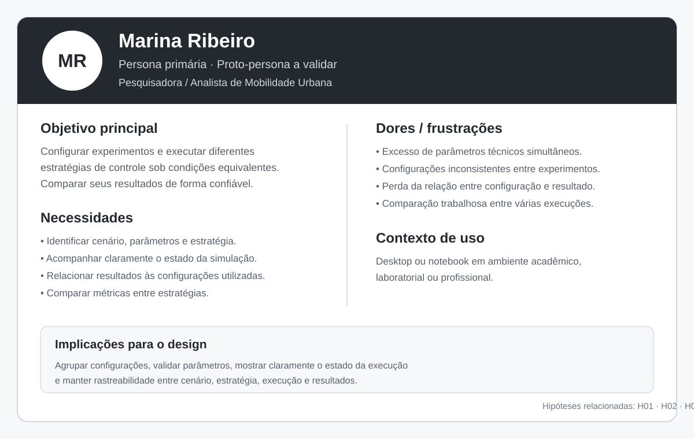
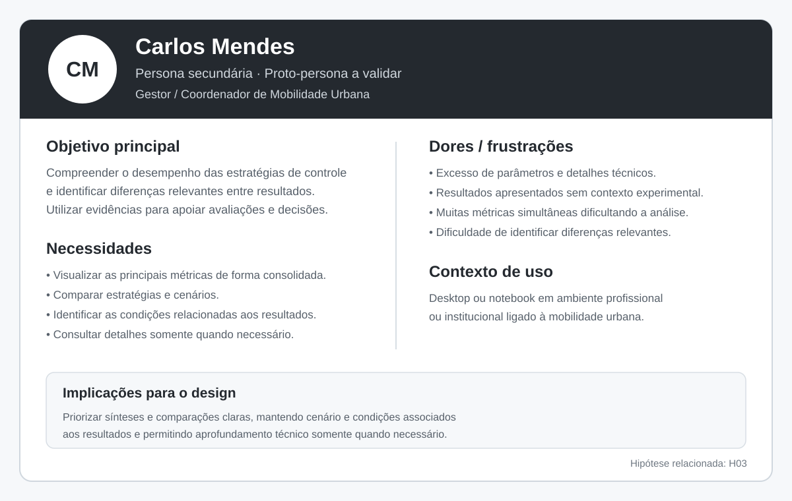
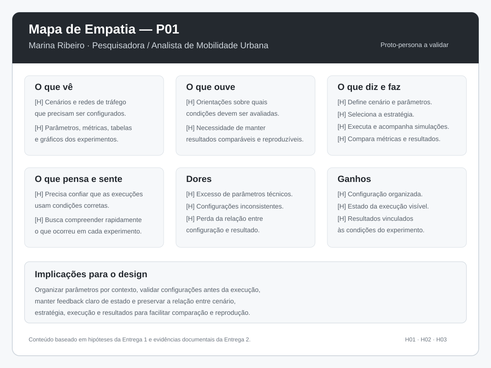

# Entrega 3 — Personas, mapa de empatia, contexto de uso e jornada

**Data:** {{09/09/2026}}  
**Status:** 🟨 em andamento 
**Responsabilidade:** 1 persona por integrante; 1 mapa de empatia, 1 contexto de uso consolidado e 1 jornada por equipe (salvo orientação diferente do docente).

## Objetivo da atividade

Representar grupos de usuários de forma útil para decisões de design. Persona não é personagem decorativo: suas características devem alterar requisitos, prioridades, linguagem, fluxos ou critérios de avaliação.

## Atenção a projetos técnicos

Em TCCs sem interface original, a persona pode representar um **profissional que se apropria da contribuição técnica**: DBA, analista, cientista de dados, administrador, pesquisador, técnico, operador, gestor ou especialista de domínio.

Não escolha um perfil apenas porque “parece combinar” com a tecnologia. Explique **qual objetivo esse perfil teria e qual parte da contribuição do TCC produziria valor para ele**. Se ainda for hipótese, mantenha como hipótese/proto-persona a validar.

Também considere papéis diferentes quando houver tarefas distintas, por exemplo:

- operador que executa análises;
- administrador que configura e gerencia permissões;
- especialista que interpreta resultados;
- gestor que consulta relatórios e decide;
- auditor que revisa histórico.

## Entradas da Entrega 1

Antes de criar personas, retome os tipos de usuários, características relevantes, objetivos e hipóteses registradas na Entrega 1. A persona **não deve transformar uma hipótese inicial em fato por meio de uma história fictícia**.

| Item da Entrega 1 | Status inicial | Evidência disponível agora | Como será tratado nesta entrega |
|---|---|---|---|
| H01 — Pesquisadores ou analistas de mobilidade representam adequadamente o usuário prioritário da interface | H | A Entrega 2 identificou Aimsun Next e PTV Vissim como ferramentas profissionais que materializam atividades semelhantes de configuração, execução e análise de simulações, mas isso ainda não constitui validação direta com usuários. | incorporar P01 como proto-persona primária e manter H01 como hipótese a validar |
| H02 — A organização da interação em definição da malha, configuração/execução e análise pode facilitar a realização dos experimentos | H | A Entrega 2 encontrou padrões de configuração, execução, feedback e análise em ferramentas profissionais, mas não houve avaliação com usuários. | utilizar como base das necessidades de P01 sem considerar H02 validada |
| H03 — Uma apresentação comparativa das métricas pode facilitar a interpretação dos métodos | H | Aimsun Next e PTV Vissim utilizam resumos, listas, gráficos e formas de comparação de resultados. | incorporar como hipótese nas necessidades de P01 e P02 e manter aberta para validação |
| Pesquisador ou analista de mobilidade urbana | H | Permanece como usuário prioritário do projeto e possui relação com T01–T08. | representar por P01 |
| Gestor de mobilidade | H | Foi identificado na Entrega 1 como stakeholder que poderia consultar resultados consolidados para apoiar avaliações e decisões. | representar por P02 como persona secundária, sem alterar o usuário prioritário |
| Uso principalmente em computadores desktop/notebooks | H | O escopo envolve mapas, parâmetros, execução e resultados; não houve validação direta com usuários. | manter como hipótese no contexto de uso |

## 1. Personas

### Persona P01 — Marina Ribeiro

**Autor(a):** Gabriel Koiama de Rocha Lira — 22.125.067-3  
**Tipo:** primária  
**Base de evidências:** proto-persona a validar / combinação entre TCC1, Entrega 1 e análise documental da Entrega 2  
**Hipóteses da Entrega 1 relacionadas:** H01, H02, H03

| Campo | Descrição |
|---|---|
| Faixa etária / contexto relevante | [H] Profissional adulto atuando em ambiente acadêmico, laboratorial ou técnico. A idade específica não é considerada determinante para a interação. |
| Ocupação/papel | [H] Pesquisadora ou analista de mobilidade responsável por preparar, executar e analisar estudos de controle de tráfego. |
| Conhecimento do domínio | [H] Possui conhecimento de tráfego, métricas de desempenho e experimentação, mas não necessariamente conhece a implementação interna do algoritmo híbrido. |
| Experiência tecnológica | [H] Está habituada ao uso de computadores e ferramentas técnicas de análise ou simulação, mas seu nível de experiência com SUMO e outras ferramentas específicas ainda precisa ser validado. |
| Objetivos | [H] Configurar experimentos corretamente, executar diferentes estratégias de controle e comparar seus resultados sob condições equivalentes. |
| Necessidades | [H] Identificar claramente cenário, parâmetros e estratégia utilizados; acompanhar o estado da execução; acessar métricas relevantes; relacionar cada resultado à configuração que o produziu. |
| Dores/frustrações | [H] Risco de configurar experimentos de forma inconsistente, perder a relação entre configuração e resultado, lidar com excesso de parâmetros técnicos e ter dificuldade para comparar múltiplas execuções. |
| Motivadores | [H] Obter resultados reproduzíveis e comparáveis e compreender de forma confiável o comportamento das diferentes estratégias de controle. |
| Restrições/acessibilidade | [?] Ainda não existem evidências sobre necessidades específicas de acessibilidade. A quantidade de informações e o espaço disponível em tela podem influenciar o uso. |
| Ambiente típico de uso | [H] Computador desktop ou notebook em ambiente acadêmico, laboratorial ou profissional. |
| Comportamentos relevantes | [H] Realiza múltiplos experimentos, altera condições de cenário ou demanda, verifica resultados e compara estratégias antes de concluir uma análise. |

**Decisões de design influenciadas por P01:**

- manter cenário, estratégia e principais parâmetros claramente identificados durante o experimento;
- agrupar configurações relacionadas para evitar excesso de informações simultâneas;
- validar parâmetros importantes antes da execução;
- apresentar feedback claro sobre o estado da simulação;
- manter os resultados vinculados à configuração e estratégia que os originaram;
- permitir comparação direta entre tempo fixo, Max Pressure e Max Pressure + actuated;
- preservar acesso às métricas detalhadas sem exigir contato com detalhes internos do código.
> Repita para P02, P03... Cada integrante deve produzir ao menos uma persona.

### Persona P02 — Carlos Mendes

**Autor(a):** João Pedro Lopes Santana Villas Bôas — 22.125.065-7  
**Tipo:** secundária  
**Base de evidências:** proto-persona a validar, construída a partir do TCC1, da Entrega 1 e da análise documental realizada na Entrega 2  
**Hipóteses da Entrega 1 relacionadas:** H03

| Campo | Descrição |
|---|---|
| Faixa etária / contexto relevante | [H] Profissional adulto atuando em contexto organizacional relacionado à mobilidade urbana. A idade específica não é considerada determinante para a interação. |
| Ocupação/papel | [H] Gestor ou coordenador de mobilidade que consulta resultados de estudos e simulações para apoiar avaliações técnicas e decisões. |
| Conhecimento do domínio | [H] Possui conhecimento sobre mobilidade urbana, indicadores de tráfego e interpretação de resultados, mas não necessariamente conhece os detalhes internos de implementação dos algoritmos avaliados. |
| Experiência tecnológica | [H] Utiliza computadores, relatórios, planilhas, dashboards ou ferramentas de análise no contexto profissional, mas sua familiaridade com simuladores específicos ainda precisa ser investigada. |
| Objetivos | [H] Compreender o desempenho das diferentes estratégias de controle, identificar diferenças relevantes entre os resultados e utilizar essas informações para apoiar avaliações ou decisões. |
| Necessidades | [H] Visualizar as principais métricas de forma consolidada; compreender quais condições produziram cada resultado; comparar estratégias ou cenários; e acessar detalhes adicionais quando necessário. |
| Dores/frustrações | [H] Excesso de parâmetros técnicos ou detalhes internos pode dificultar a identificação das informações relevantes; resultados sem contexto podem dificultar a comparação; e grande quantidade de métricas simultâneas pode tornar a análise confusa. |
| Motivadores | [H] Obter informações confiáveis, comparáveis e compreensíveis que apoiem a avaliação do comportamento das estratégias de controle semafórico. |
| Restrições/acessibilidade | [?] Ainda não existem evidências sobre necessidades específicas de acessibilidade desse perfil. A clareza das informações e a redução de complexidade técnica desnecessária podem influenciar a utilização da interface. |
| Ambiente típico de uso | [H] Computador desktop ou notebook em ambiente profissional ou institucional, principalmente durante a consulta e análise de resultados de estudos de mobilidade. |
| Comportamentos relevantes | [H] Prioriza informações consolidadas e comparações entre resultados, consultando detalhes técnicos somente quando eles são necessários para compreender ou justificar uma análise. |

**Decisões de design influenciadas por P02:**

- apresentar inicialmente as métricas mais relevantes de forma consolidada;
- permitir acesso a informações detalhadas sem obrigar o usuário a visualizar todos os parâmetros técnicos;
- deixar explícitos o cenário, a estratégia e as condições experimentais associados a cada resultado;
- utilizar terminologia do domínio de mobilidade sem depender de nomes internos do código;
- favorecer comparação visual entre estratégias e cenários;
- apresentar resultados de forma que diferenças relevantes possam ser identificadas rapidamente;
- permitir consultar uma síntese dos resultados sem eliminar a possibilidade de aprofundamento.
- 
### Síntese das personas

P01 — Marina Ribeiro é a persona prioritária do projeto, pois representa o perfil que percorre o fluxo experimental completo previsto para a interface: definição do cenário, configuração dos parâmetros, seleção da estratégia de controle, execução da simulação, acompanhamento do estado e análise e comparação dos resultados.

P02 — Carlos Mendes representa uma persona secundária, com interesse concentrado principalmente na interpretação dos resultados produzidos pelos experimentos. Diferentemente de P01, seu objetivo principal não é configurar ou executar a simulação, mas compreender as principais métricas, comparar estratégias e utilizar essas informações como apoio para avaliações ou decisões relacionadas à mobilidade.

Essa diferença influencia diretamente o design da interface. Para P01, é importante oferecer maior controle sobre o experimento, manter cenário, parâmetros e estratégia claramente identificados e garantir rastreabilidade entre configuração, execução e resultado. Para P02, a prioridade está na apresentação clara e consolidada das métricas, na comparação entre estratégias e no acesso a detalhes técnicos somente quando necessário.

As duas personas representam papéis complementares e não apenas diferenças demográficas. P01 está relacionada principalmente às atividades T01–T08, enquanto P02 possui maior relação com T06, T07 e T08, referentes à consulta, comparação e síntese dos resultados.

Como ainda não houve validação direta desses perfis com usuários reais, P01 e P02 permanecem como proto-personas a validar. As hipóteses associadas a elas deverão continuar sendo investigadas nas próximas entregas e poderão ser refinadas caso novas evidências indiquem necessidades, comportamentos ou perfis diferentes.

## 2. Mapa de empatia — equipe

**Persona escolhida:** P01 — Marina Ribeiro  
**Justificativa:** P01 foi escolhida por representar a persona primária e o perfil que percorre o fluxo experimental completo do projeto, desde a definição e configuração do experimento até a execução, acompanhamento e análise dos resultados.

Documente também em texto: o que vê; ouve; diz/faz; pensa/sente; dores; ganhos. Diferencie **evidência** de **hipótese**.

## 3. Contexto de uso — consolidação

| Dimensão | Descrição | Implicação de design |
|---|---|---|
| Usuários | **[H]** P01 — Marina Ribeiro representa o usuário primário, responsável principalmente por configurar, executar, acompanhar e analisar experimentos. **[H]** P02 — Carlos Mendes representa um perfil secundário interessado principalmente na interpretação, comparação e síntese dos resultados. Ambos permanecem como proto-personas a validar. | A interface deve priorizar o fluxo experimental completo de P01, mas apresentar os resultados de forma suficientemente clara e consolidada para que P02 possa interpretá-los sem precisar compreender todos os detalhes internos da implementação. |
| Tarefas | **[F/H]** O projeto considera as tarefas T01–T08: definir ou selecionar a malha viária, configurar parâmetros, selecionar a estratégia, iniciar a simulação, verificar seu estado, consultar métricas, comparar resultados e consultar ou gerar uma síntese. As tarefas derivam da metodologia do TCC e das hipóteses de uso levantadas na Entrega 1. | A navegação deve manter uma relação clara entre preparação do experimento, execução e análise dos resultados, sem apresentar todas as funcionalidades simultaneamente. |
| Equipamentos | **[H]** O uso ocorrerá principalmente em computadores desktop ou notebooks, considerando a necessidade de trabalhar com mapas, parâmetros, acompanhamento visual da simulação, tabelas e gráficos. | A interface deve ser projetada prioritariamente para telas de computador. Não há evidência atual que justifique priorizar uma versão móvel. |
| Ambiente físico | **[H]** A utilização poderá ocorrer em ambientes acadêmicos, laboratoriais ou profissionais. **[?]** Não foram identificadas até o momento condições físicas específicas, como ruído, iluminação ou mobilidade, que sejam determinantes para a interação. | A principal preocupação atual deve ser a organização da grande quantidade de informações na tela e não adaptações a uma condição física específica ainda não identificada. |
| Ambiente social/organizacional | **[F]** No contexto atual do TCC, os experimentos são desenvolvidos por uma equipe e acompanhados por um orientador. **[H]** Em um contexto profissional, diferentes pessoas podem participar da configuração dos estudos, interpretação dos resultados ou tomada de decisão. | Os resultados e configurações devem ser apresentados de forma que possam ser compreendidos e revisados por pessoas que não participaram diretamente de todas as etapas da execução. |
| Papéis/permissões/governança | **[?]** Não existe evidência atual que justifique diferentes níveis de acesso, perfis administrativos ou mecanismos de permissão. P01 e P02 possuem objetivos diferentes, mas isso não implica automaticamente diferentes permissões no sistema. | Não criar login, administração de usuários ou estruturas de permissão sem que necessidades futuras justifiquem essas funcionalidades. |
| Volume de dados/histórico | **[F/H]** A metodologia envolve múltiplos cenários, estratégias e execuções. Manter a relação entre cada execução e suas condições é relevante para comparação e reprodução. **[?]** A necessidade de um histórico avançado com busca e filtros ainda não foi validada. | Garantir rastreabilidade entre cenário, estratégia, parâmetros e resultados. Recursos avançados de histórico, busca e filtros devem permanecer como possibilidades até que sua necessidade seja confirmada. |

---

## 4. Jornada do usuário — equipe

**Persona:** P01 — Marina Ribeiro  
**Objetivo da jornada:** avaliar e comparar o desempenho de diferentes estratégias de controle semafórico em condições de tráfego definidas.  
**Início e fim da jornada:** a jornada começa quando surge a necessidade de investigar o comportamento das estratégias em determinado cenário de tráfego e termina quando os resultados das execuções são interpretados, comparados e sintetizados para apoiar uma conclusão sobre o experimento.

| Etapa | Situação/ação | Objetivo | Pensamento/emoção | Dor | Oportunidade de design | Evidência |
|---|---|---|---|---|---|---|
| 1 — Definição do estudo | Marina identifica uma condição de tráfego ou cenário que deseja investigar. | Definir claramente qual situação será utilizada no experimento. | **[H]** “Preciso estabelecer quais condições quero avaliar antes de executar as estratégias.” | **[H]** Dificuldade de identificar ou organizar corretamente o cenário que será utilizado. | Apresentar de forma clara qual cenário ou malha está selecionado e quais condições gerais serão utilizadas. | Entrega 1 — A01/T01; H02. |
| 2 — Preparação do cenário | Define ou seleciona a malha e as condições de demanda que serão utilizadas. | Garantir que o ambiente represente a condição experimental desejada. | **[H]** “Preciso ter certeza de que todas as estratégias serão avaliadas nas mesmas condições.” | **[H]** Alterações não percebidas entre diferentes execuções podem comprometer a comparação. | Manter as condições principais do cenário visíveis e permitir verificar sua configuração antes da execução. | Entrega 1 — T01/T02; Entrega 2 — RC01 e RC05. |
| 3 — Configuração do experimento | Define os parâmetros necessários e seleciona a estratégia de controle semafórico. | Preparar corretamente a execução que será realizada. | **[H]** “Quero alterar somente os parâmetros necessários sem perder o controle sobre as condições do experimento.” | **[H]** Grande quantidade de parâmetros técnicos e risco de configuração incompleta ou inconsistente. | Agrupar parâmetros relacionados, destacar a estratégia escolhida e validar configurações importantes antes da execução. | H02; T02/T03; Entrega 2 — RC03 e RC04. |
| 4 — Verificação e início | Revisa as principais condições configuradas e inicia a simulação. | Evitar executar um experimento com condições incorretas. | **[H]** “Antes de começar, preciso saber se está tudo configurado corretamente.” | **[H]** Descobrir uma configuração inválida somente depois de realizar a simulação gera retrabalho. | Apresentar uma verificação das condições principais e mensagens de erro próximas ao elemento que precisa ser corrigido. | T04; Entrega 2 — RC04. |
| 5 — Acompanhamento da execução | Observa a simulação e verifica seu estado enquanto o experimento está em andamento. | Saber se a execução está ocorrendo normalmente e identificar quando ela foi concluída ou apresentou problema. | **[H]** “A simulação está funcionando corretamente? Qual estratégia está sendo executada agora?” | **[H]** Falta de feedback sobre estado, estratégia ou progresso pode gerar incerteza durante a execução. | Manter estado da execução, cenário e estratégia claramente visíveis e fornecer feedback de andamento, conclusão ou falha. | T04/T05; Entrega 2 — RC02. |
| 6 — Análise dos resultados | Consulta as métricas produzidas após a execução. | Compreender o desempenho da estratégia nas condições analisadas. | **[H]** “Quais foram os principais resultados desta execução e em quais condições eles foram obtidos?” | **[H]** Muitas métricas sem hierarquia ou contexto podem dificultar a interpretação. | Apresentar inicialmente as métricas principais de forma consolidada e permitir consultar valores mais detalhados quando necessário. | T06; H03; Entrega 2 — RC05, RC06 e RC09. |
| 7 — Comparação e síntese | Compara os resultados das estratégias de tempo fixo, Max Pressure e Max Pressure + actuated e registra suas conclusões. | Identificar diferenças de desempenho entre os métodos sob condições equivalentes. | **[H]** “Quero entender qual estratégia apresentou melhor comportamento e em quais condições essa diferença ocorreu.” | **[H]** Comparar manualmente várias execuções e métricas pode ser trabalhoso, especialmente quando as condições experimentais não estão claramente associadas aos resultados. | Permitir comparação direta entre estratégias, mantendo visíveis as condições dos experimentos e oferecendo uma síntese dos principais resultados. | T07/T08; H03; Entrega 2 — RC05, RC06, RC07 e RC09. |

> A jornada representa a atividade de P01 antes, durante e depois da execução do experimento. As etapas descrevem objetivos e problemas do usuário, e não uma sequência obrigatória de telas da futura interface.

---

## Síntese

A Entrega 3 reforça que o projeto deve priorizar a realização do fluxo experimental completo por P01, mantendo ao mesmo tempo os resultados compreensíveis para P02. As personas e a jornada indicam que as etapas seguintes do projeto devem preservar a relação entre cenário, parâmetros, estratégia, execução e resultados.

Nos próximos cenários e análises de tarefas, devem obrigatoriamente aparecer os seguintes objetivos e necessidades:

- definir ou selecionar claramente o cenário e as condições do experimento;
- configurar parâmetros sem expor complexidade técnica desnecessária;
- identificar de forma explícita qual estratégia de controle será executada;
- prevenir configurações incompletas ou inconsistentes antes da execução;
- compreender o estado atual da simulação e receber feedback sobre conclusão ou falha;
- consultar as principais métricas produzidas pelo experimento;
- manter cada resultado relacionado às condições que o produziram;
- comparar diretamente tempo fixo, Max Pressure e Max Pressure + actuated sob condições equivalentes;
- oferecer uma síntese dos resultados sem impedir o acesso a informações detalhadas;
- evitar criar funcionalidades como administração de usuários, permissões ou histórico avançado enquanto não houver evidência que justifique sua necessidade.

P01 permanece como persona prioritária porque percorre todas as etapas do fluxo experimental, enquanto P02 possui maior relação com as atividades de consulta, comparação e síntese dos resultados. Como as duas foram construídas como proto-personas, suas características e necessidades permanecem sujeitas a validação e poderão ser refinadas quando novas evidências forem obtidas.

---

## Checklist

- [x] Existe pelo menos uma persona por integrante.
- [x] As personas não são apenas diferenças demográficas superficiais.
- [x] Está claro o que é dado real e o que é hipótese/proto-persona.
- [x] A persona não “validou por ficção” uma hipótese da Entrega 1; afirmações continuam marcadas como hipótese quando não há evidência.
- [x] Objetivos e dores têm consequência para o design.
- [x] Contexto de uso está coerente com a Entrega 1.
- [x] Em TCC sem interface original, a persona possui relação explícita com a contribuição técnica. *(O projeto já previa parcialmente uma interface; ainda assim, as personas foram explicitamente relacionadas às atividades e à contribuição técnica do TCC.)*
- [x] Papéis administrativos, técnicos e decisórios só foram criados quando possuem objetivos/tarefas diferentes.
- [x] Jornada possui etapas, dores e oportunidades e não é apenas wireflow.
- [ ] IDs das personas foram adicionados à rastreabilidade.
